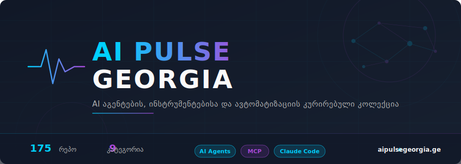

  

<h1 align="center">Awesome AI Tools</h1>

  <b>A curated collection of AI agent frameworks, developer tools, and automation resources</b> 
  Curated by <a href="https://github.com/Jabanagithb">Jabanagithb</a>

  
  
  

<i>A curated collection of AI agent frameworks, developer tools, and automation resources</i>

---

## Table of Contents

- [AI Agents & Orchestration](#ai-agents--orchestration)
- [Claude Code Extensions & Skills](#claude-code-extensions--skills)
- [MCP Servers & Integrations](#mcp-servers--integrations)
- [Browser Automation](#browser-automation)
- [AI Research & Development](#ai-research--development)
- [Memory & Knowledge Management](#memory--knowledge-management)
- [Productivity & Automation](#productivity--automation)
- [Resources & References](#resources--references)

---

## AI Agents & Orchestration

| Repository | Description |
|---|---|
| [Paperclip](https://github.com/paperclipai/paperclip) | Node.js server + React UI that orchestrates a team of AI agents to run businesses autonomously (zero-human companies). Users provide their own agents (OpenClaw, Claude Code, Codex, Cursor, Bash, HTTP), set company goals, and see a dashboard — org chart, budget, governance, and audit log. As the README says: "If OpenClaw is an employee, Paperclip is the company." |
| [MiroFish](https://github.com/666ghj/MiroFish) | Multi-agent swarm intelligence engine that creates a digital parallel world from real data (news, politics, financial signals) and runs simulations of thousands of agents for prediction. Agents have individual personalities, long-term memory, and behavioral logic. Works at macro (policy testing) and micro (creative scenario simulation) levels. |
| [Hermes](https://github.com/nousresearch/hermes-agent) | Self-improving AI agent from Nous Research with a built-in learning loop. Creates skills from experience, improves them, stores memory, searches its own past conversations, and builds a user profile across sessions. Supports any LLM, multiple platforms (Telegram, Discord, Slack, WhatsApp, Signal), cron automation, and sub-agents. |
| [OpenClaw](https://github.com/openclaw/openclaw) | Personal AI assistant that works on any OS and platform ("the lobster way"). Unifies 20+ messaging channels (WhatsApp, Telegram, Slack, Discord, Signal, iMessage), voice, and Canvas on macOS/iOS/Android. Supports multi-agent routing, tools (browser, cron, sessions), voice wake mode, and local-first design. |
| [OpenSpace](https://github.com/HKUDS/OpenSpace) | Self-evolving AI agent framework that enables agents to automatically learn, improve, and share skills with each other (AUTO-FIX, AUTO-IMPROVE, AUTO-LEARN). Reduces token cost by 46% and improves task quality. Works with Claude Code, OpenClaw, Codex, Cursor, and other autonomous agents. |

## Claude Code Extensions & Skills

| Repository | Description |
|---|---|
| [Oh My ClaudeCode](https://github.com/yeachan-heo/oh-my-claudecode) | Multi-agent orchestration plugin for Claude Code with autonomous modes: autopilot (5-phase pipeline), team (parallel agents on a shared task list), ralph (works until everything is verified), and ultrawork (maximum parallelism for fast fixes). |
| [Superpowers](https://github.com/obra/superpowers) | Agent skills and workflow framework that enhances Claude Code (and Cursor, Codex) with structured workflows — debugging, test-driven development, brainstorming, code review, specification-based development, and parallel agent dispatching. |
| [Everything Claude Code](https://github.com/affaan-m/everything-claude-code) | AI agent harness performance optimization system — skills, instincts, memory optimization, security scanning, and research-driven development. Works with Claude Code, Codex, and other AI agent harnesses. |
| [Claude Code Setup](https://github.com/tornikebolokadze1-cyber/claude-code-setup) | Ready-made Claude Code configuration with 17 rules, 7 hooks, 7 templates, and a /setup command — a professional working environment in one step. |
| [UI UX Pro Max](https://github.com/nextlevelbuilder/ui-ux-pro-max-skill) | UI/UX design automation skill for Claude Code. 67+ design styles, color palettes, font pairings, and structured design system generation with AI assistant support. |
| [Codex Plugin for Claude Code](https://github.com/openai/codex-plugin-cc) | OpenAI's official plugin that lets you delegate code review and development tasks to OpenAI's Codex agent directly from Claude Code — two AI coding assistants working together. |
| [GSD (Get Shit Done)](https://github.com/gsd-build/get-shit-done) | Meta-prompting and specification-based development system for Claude Code (and Codex, Cursor, Gemini CLI) that solves the context rot problem — quality degradation that happens when an AI agent fills up its context. |
| [Obsidian Skills](https://github.com/kepano/obsidian-skills) | Agent skills for working with Obsidian vaults. Read, write, search, and manage Markdown, Bases, and JSON Canvas files directly from Claude Code, Codex CLI, or any AgentSkills-compatible agent. |
| [n8n Skills](https://github.com/czlonkowski/n8n-skills) | Collection of n8n workflow automation skills for Claude Code — ready-made templates, patterns, and best practices for building n8n workflows with AI assistant support. Companion project: [n8n-MCP](https://github.com/czlonkowski/n8n-mcp) ([n8n-skills.com](https://www.n8n-skills.com/)). |

## MCP Servers & Integrations

| Repository | Description |
|---|---|
| [n8n-MCP](https://github.com/czlonkowski/n8n-mcp) | MCP server that connects AI assistants (Claude Code, Cursor, Windsurf) to the n8n workflow automation platform. Builds, validates, and manages n8n workflows using natural language. Companion project: [n8n-skills](https://github.com/czlonkowski/n8n-skills) ([n8n-mcp.com](https://www.n8n-mcp.com/) / [n8n-skills.com](https://www.n8n-skills.com/)). |
| [Playwright MCP](https://github.com/microsoft/playwright-mcp) | Microsoft's official Playwright MCP server for browser automation from AI agents — testing, scraping, and web interaction directly from Claude Code. |
| [Prism MCP](https://github.com/dcostenco/prism-mcp) | Active cognitive architecture MCP server that gives AI agents persistent memory, a self-organizing knowledge graph, multi-agent synchronization, and Obsidian vault export for structured knowledge management. |
| [Claude Peers MCP](https://github.com/louislva/claude-peers-mcp) | MCP server that allows multiple Claude Code instances running on the same machine to discover each other and communicate in real time. Built for developers who work in parallel across multiple Claude sessions on different projects and need them to collaborate via instant messaging. |
| [GitHub MCP Server](https://github.com/github/github-mcp-server) | GitHub's official MCP server that directly connects AI tools to the GitHub platform. Allows AI agents to perform GitHub operations using natural language — repository management, issue tracking, and workflow automation. |
| [Context7](https://github.com/upstash/context7) | MCP server that delivers up-to-date, version-specific documentation directly into LLM prompts, eliminating hallucinated APIs and outdated code examples. Built for developers using AI coding assistants (Cursor, Claude Code) who need accurate, current library documentation. |

## Browser Automation

| Repository | Description |
|---|---|
| [Playwright CLI](https://github.com/microsoft/playwright-cli) | Token-efficient CLI interface for Playwright browser automation, designed as skills for coding agents. Lightweight browser control without MCP overhead, optimized for Claude Code, GitHub Copilot, and other AI coding assistants. Supports recording, code generation, and selector inspection. |
| [Browser Use](https://github.com/browser-use/browser-use) | Python library that makes websites accessible to AI agents — form filling, navigation, and data extraction automatically. Built for browser-based AI automation pipelines. |

## AI Research & Development

| Repository | Description |
|---|---|
| [AutoResearch](https://github.com/karpathy/autoresearch) | Minimal autonomous ML experiment setup from Andrej Karpathy — iteratively modifies and trains a small LLM on a single GPU, runs experiments overnight, and keeps only improvements. Automates hyperparameter and architecture search for ML researchers. |
| [LightRAG](https://github.com/hkuds/lightrag) | Lightweight Retrieval-Augmented Generation framework with graph-based knowledge indexing (EMNLP 2025). Provides fast and accurate search across large document collections for AI agents. |
| [Pretext](https://github.com/chenglou/pretext) | Pure JavaScript/TypeScript library for multi-line text measurement and layout without DOM reflow. Supports Canvas, SVG, and DOM rendering with fast, accurate text layout in multiple languages. Useful for virtualization and masonry layouts. |

## Memory & Knowledge Management

| Repository | Description |
|---|---|
| [Hindsight](https://github.com/vectorize-io/hindsight) | Agent memory system that goes beyond conversation recall and helps AI agents learn and improve over time, not just remember. Delivers state-of-the-art long-term memory performance (LongMemEval benchmark). |
| [Claude Mem](https://github.com/thedotmack/claude-mem) | Memory compression system for Claude Code — automatically captures everything Claude does during a session, compresses it with AI, and returns relevant context in subsequent sessions. |
| [NotebookLM Python](https://github.com/teng-lin/notebooklm-py) | Unofficial Python API and CLI for Google NotebookLM with full programmatic access to NotebookLM features, including ones not available in the web interface. Built for developers and AI agents to automate notebook operations. |

## Productivity & Automation

| Repository | Description |
|---|---|
| [Google Workspace CLI](https://github.com/googleworkspace/cli) | Unified command-line tool for managing Google Workspace services — Drive, Gmail, Calendar, Sheets, Docs, Chat, and Admin. Dynamically built from Google Discovery Service, with CLI and AI agent access to the full Google Workspace ecosystem. |

## Resources & References

| Repository | Description |
|---|---|
| [Awesome Claude Code](https://github.com/hesreallyhim/awesome-claude-code) | Curated list of Claude Code resources, plugins, skills, MCP servers, and community tools — the definitive catalog of the Claude Code ecosystem. |
| [Claude How-To](https://github.com/luongnv89/claude-howto) | Visual, example-based guide for Claude Code — from basic concepts to advanced agents, with copy-paste templates for quick start. |
| [Free LLM API Resources](https://github.com/cheahjs/free-llm-api-resources) | Curated list of free LLM inference APIs and resources for developers and hobbyists who want to experiment with language models without API fees. |
| [Public APIs](https://github.com/public-apis/public-apis) | Massive collective list of free APIs by category — the main reference for developers looking for public data sources and services for integration. |

---

## About

This list is maintained by **[Jabanagithb](https://github.com/Jabanagithb)** — curating the best AI agent frameworks, automation tools, and developer resources.

If you find this list useful, give it a star and share it with others who build with AI agents.

## Contributing

Found an awesome repository that belongs on this list? Open an issue or submit a pull request.

## License

